# SDW快速出图技术路线

<!-- 
# 目录

[1 ASD线路出图 [3](#asd线路出图)](#asd线路出图)

[1.1 简介 [3](#简介)](#简介)

[1.2 配置资源集 [3](#配置资源集)](#配置资源集)

[1.3 图框模板 [4](#图框模板)](#图框模板)

[1.4 标题栏模板 [7](#标题栏模板)](#标题栏模板)

[1.5 图纸模板 [11](#图纸模板)](#图纸模板)
SDW快速出图技术路线0f7ba6a5-d34e-4d1a-bebb-d74b757a6296
[1.6 路线平曲线 [12](#路线平曲线)](#路线平曲线)

[1.6.1 直线段标注 [12](#直线段标注)](#直线段标注)

[1.6.2 圆弧段标注 [13](#圆弧段标注)](#圆弧段标注)

[1.6.3 缓和曲线端点标注 [14](#缓和曲线端点标注)](#缓和曲线端点标注)

[1.6.4 圆弧中点标注 [16](#圆弧中点标注)](#圆弧中点标注)

[1.6.5 主里程点标注 [17](#主里程点标注)](#主里程点标注)

[1.6.6 次里程点标注 [18](#次里程点标注)](#次里程点标注)

[1.6.7 水平曲线规则集 [19](#水平曲线规则集)](#水平曲线规则集)

[1.6.8 水平视图 [21](#水平视图)](#水平视图)

[1.7 线路纵曲线 [22](#线路纵曲线)](#线路纵曲线)

[1.7.1 直线段标注 [22](#直线段标注-1)](#直线段标注-1)

[1.7.2 圆弧段标注 [23](#圆弧段标注-1)](#圆弧段标注-1)

[1.7.3 竖直曲线规则集 [25](#竖直曲线规则集)](#竖直曲线规则集)

[1.7.4 垂直试图 [26](#垂直试图)](#垂直试图)

[1.8 线路出图 [28](#线路出图)](#线路出图)

[1.8.1 添加环境变量 [28](#线路出图)](#线路出图)

[1.8.2 线路出图 [28](#线路出图-1)](#线路出图-1)
 -->


## ASD线路出图

### 简介

3D体验平台（2021XPF3以上）中针对土木工程行业具有专业的出图模块，其中的Drafting
Template Design应用模块，有专业的线路出图功能。线路出图功能可通过对Civil
3D
Design的水平线路和纵面线路进行平总曲线的出图。平台中默认的出图标注方式是根据国外出图规范定义的，无法满足中国本地应用需求，针对国内出图规范，对相应的模板进行自定义，以使平台满足本地化线路出图的专业要求。

### 配置资源集

导入出图模板以及目录Alignment drawing templates和NewAlignment view
drawing templates A.1，切换到所有者角色，进入Data
Setup模块设置出图模板资源


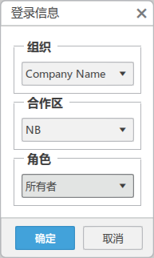

点开ASD工程制图资源，编辑各模板所对应的目录

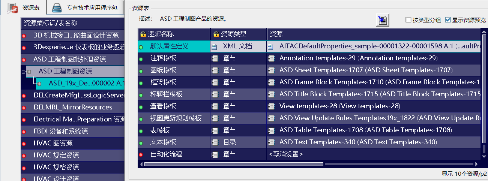

把资源绑定到合作区，保存并切换到领导角色。

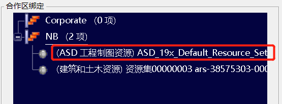

### 图框模板

新建ASD工程图模板，进入到Drafting Template
Design模块，在工具栏智能模板管理下，点击框架模板新建框架模板。

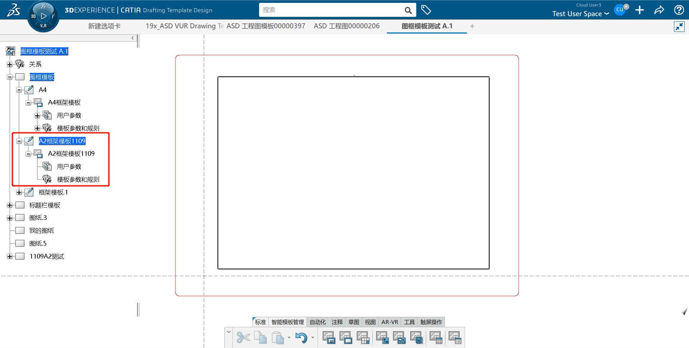

用草图轮廓命令，画出矩形轮廓，在注释栏选用标注命令，约束好矩形框的长、宽

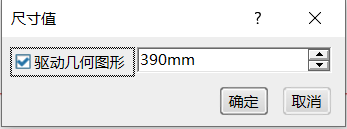

约束完成之后，双击尺寸约束选择驱动几何图形；在结构树模板参数和规则下，插入actions，编辑脚本：

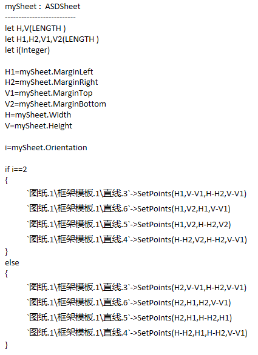

其中ASDSheet.Orientation为图纸的方向，当输出为'1'时，图纸为纵向，输出为'2'时，图纸为横向；

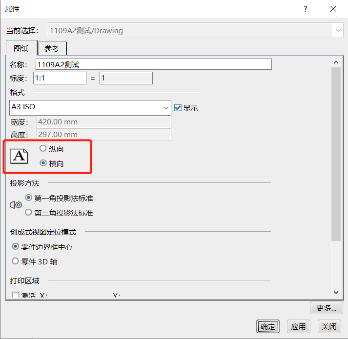

在确定了图纸的类型之后，图纸的长宽尺寸是固定的，我们只需要提取到宽度和高度尺寸，赋予到标注即可

ASDSheet. Height
-------------------//图纸高度（长度参数）

ASDSheet. Width
-------------------//图纸宽度（长度参数）

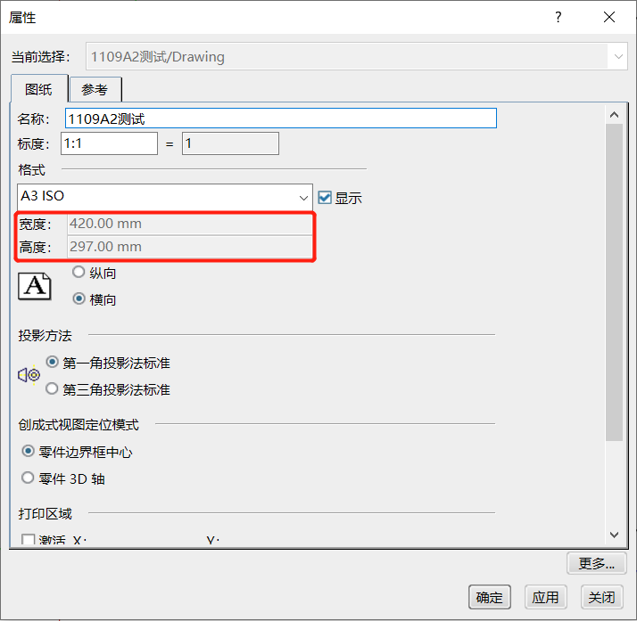

ASDSheet.MarginBottom-------------------//图纸工作区的底边距

ASDSheet.MarginLeft-------------------//图纸工作区的左边距

ASDSheet.MarginRight-------------------//图纸工作区的右边距

ASDSheet.MarginTop-------------------//图纸工作区的左顶边距

完成之后隐藏标注尺寸，保存并把框架模板加入到图框模板catalog

上述为通用参数化框架，如果需要特殊框架，可以新建框架模板之后，用草绘功能根据纸张尺寸画出所需要的框架。

###  标题栏模板

在刚才的Drafting Template
Design模块继续编辑标题栏模板，点击标题块模板图标，新建标题栏模板；利用草图轮廓命令，草绘完成大致标题栏的样式。

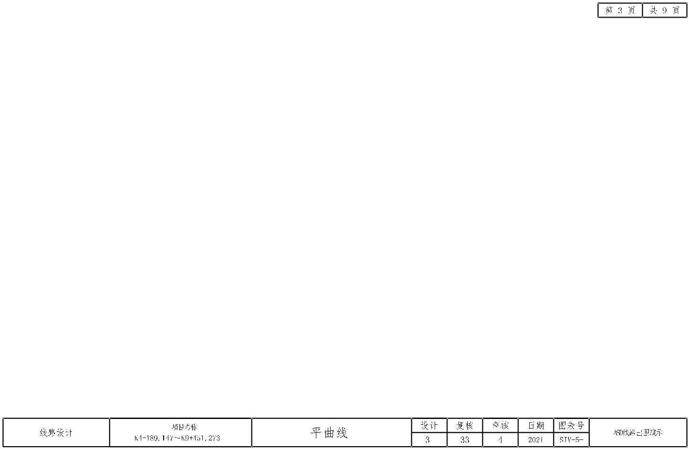

在结构树上添加需要的参数

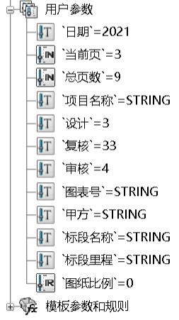

在设计好的标题栏相应位置，新建文本，并根据图框的需求输入文本内容

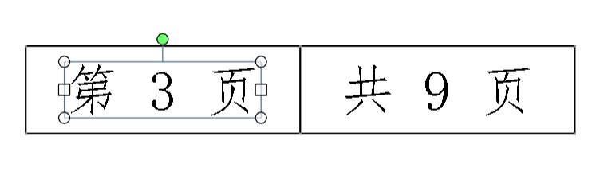

文本框内的内容分为固定文本和参数文本，其中固定文本只需要双击文本框填写好相应文本即可，参数文本需要链接到结构树上的参数，下面以页数为例：

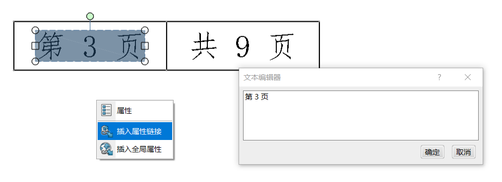

双击文本框，弹出文本编辑器，右键文本框，弹出插入属性链接对话框

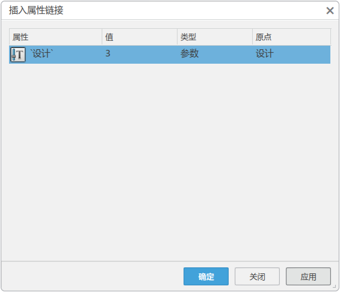

在结构树上选择需要链接的参数，把此参数选择到插入属性链接对话框，再次单击选中对话框中的参数，点击确定，把结构树上的参数和文本框中的文本相结合

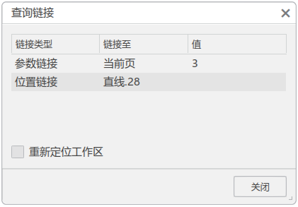

参数链接完成之后，在模板和参数规则下插入actions脚本，让参数受图纸约束

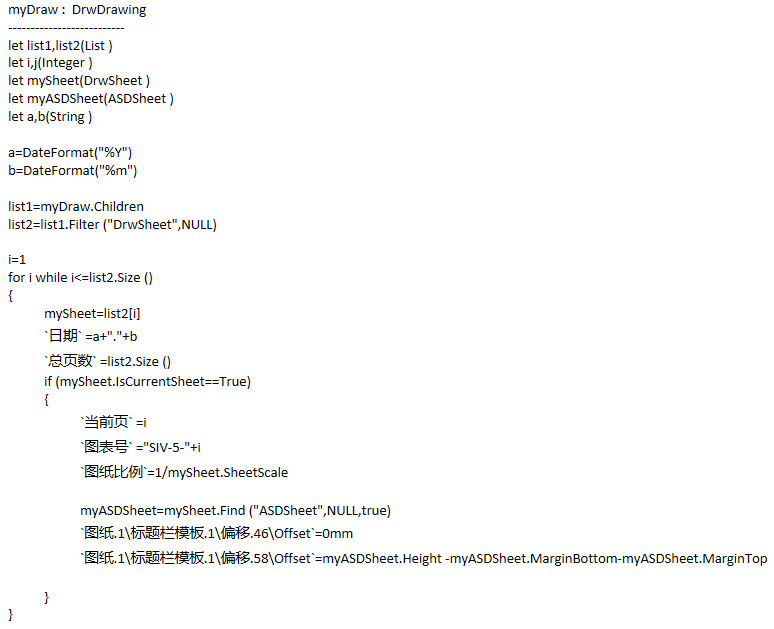

DateFormat("%Y")为系统时间年

DateFormat("%m")为系统时间月

My_sheet.SheetScale 为当前的图纸比例

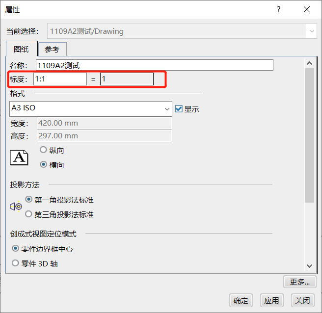

mySheet.IsCurrentSheet==True-------------------//当前页

上述脚本旨在控制结构树上的用户参数，进而通过脚本链接控制文本内容，比如在实例化的时候，文本内容会判断出当前的图纸在工程图的位置，检测出系统当前的时间等，节省了相关人员处理标题栏的时间。

设置完成之后保存到标题栏目录。

### 图纸模板

完成图框模板和标题栏模板之后，建立图纸模板，打开图纸模板定义，对话框中定义和工作区中的内容，我们在编辑图框和标题栏时，已经把相应参数通过脚本提取出来，并关联到参数中

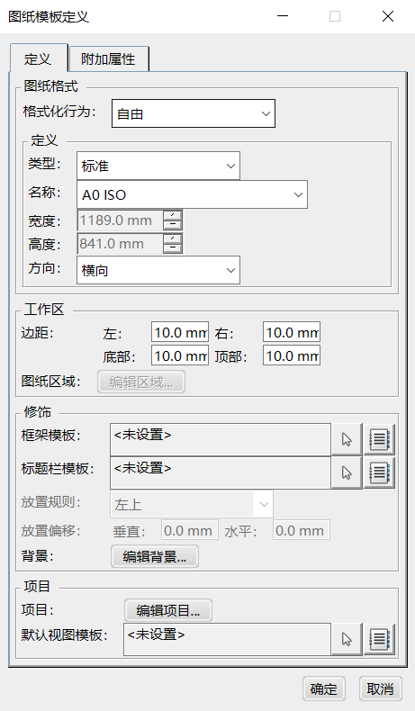

在修饰工作区内选择目录，会弹出在全局资源中加载到ASD中的目录，选择需要设置的模板，放置规则根据需求设置在图纸的位置。设置完成之后保存图纸模板，添加到图纸模板目录。

## 路线平曲线

### 直线段标注

进入Drafting Template
Design模块，新建详图，建立注释模板，在注释栏下创建文本，文本内容R-∞

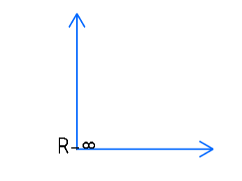

设置文字标注相应字体DS ISO 1，定位点为中部居中，参考为父级零部件

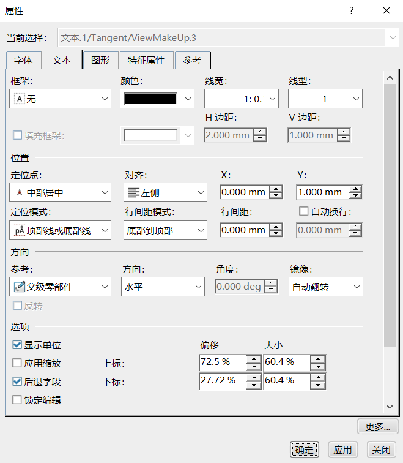

新建actions并编辑脚本

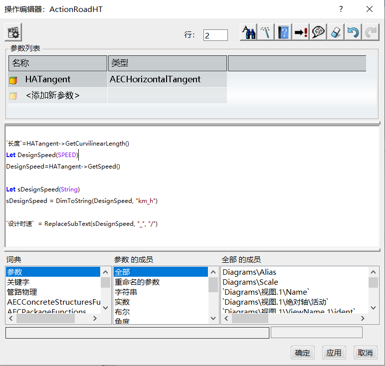

输入条件HATangent :
AECHorizontalTangent为平曲线直线段，"长度""设计时速"为隐藏的文本注释，在新建平曲线出图的时候，只显示R-∞

### 圆弧段标注

新建详图，建立注释模板，在注释栏下创建文本，文本内容R-0m

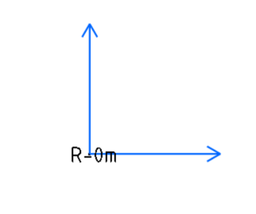

文本设置参照直线段文字标注，新建actions并编辑脚本

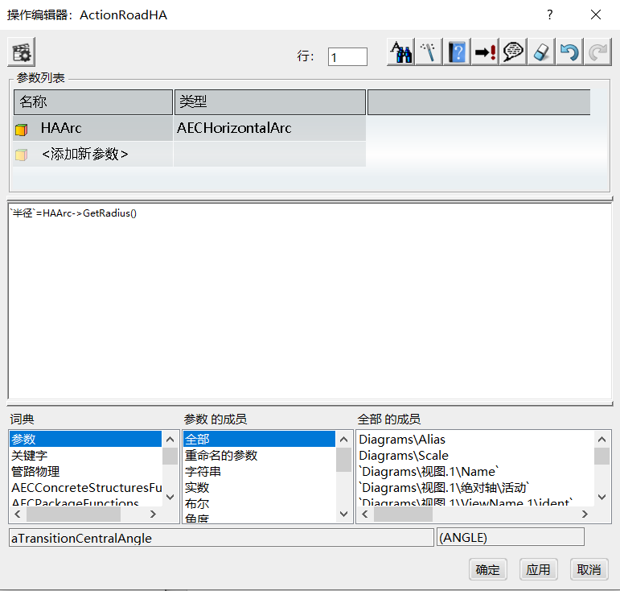

输入条件HAArc :
AECHorizontalArc为平曲线圆弧段，HAArc->GetRadius()为获取平曲线曲线段半径

### 缓和曲线端点标注

新建详图，建立注释模板，添加字符串参数sAheadStation、'关键点符号'，绘制箭头并添加文本注释如下：

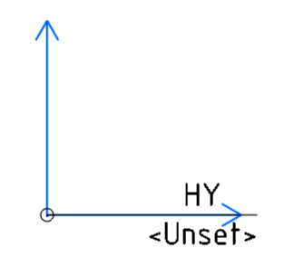

文本注释添加参数链接，添加方式同标题栏，添加actions并编辑脚本

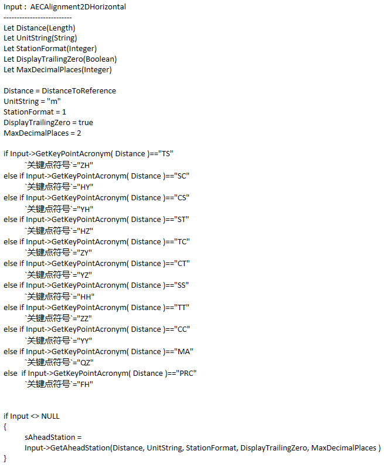

Input->GetKeyPointAcronym-------------------//关键点首字母缩略词

因脚本函数只能获取固定字符，且此字符不符合国内标注习惯，所以添加判断语句if---else
if---else if---让标注形式符合国内使用习惯

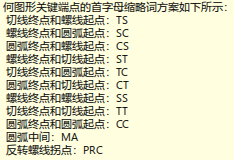

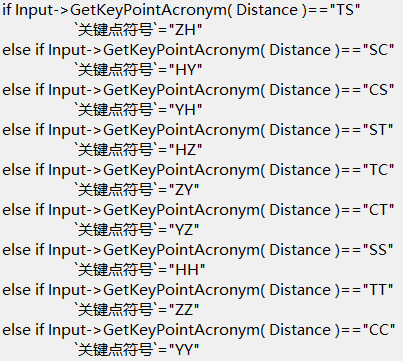

输入Input : AECAlignment2DHorizontal为平曲线

新建注释模板为缓和曲线端点，建立子注释模板，并选择刚才建立的注释模板为子模板，以此缓和曲线端点为特征加入到目录并保存。

### 圆弧中点标注

新建详图，建立注释模板，添加字符串参数sAheadStation，绘制直线并添加文本注释如下：

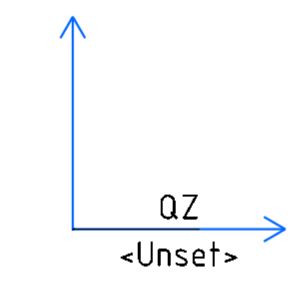

文本注释添加参数链接，添加方式同标题栏，添加actions并编辑脚本

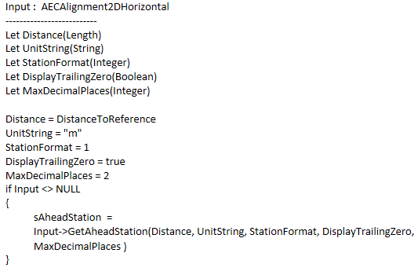

圆弧中点标注曲中点QZ固定，不必设置参数，直接建立文本标注QZ即可，输入Input
: AECAlignment2DHorizontal为平曲线，Input->GetAheadStation获取里程。

新建注释模板为圆弧中点，建立子注释模板，并选择刚才建立的注释模板为子模板，以此圆弧中点为特征加入到目录并保存。

### 主里程点标注

新建详图，建立注释模板，添加字符串参数DistanceToReference、sStationing，绘制直线并添加文本注释如下：

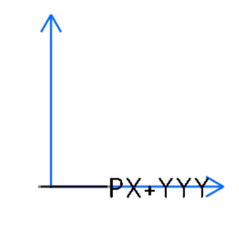

文本注释添加参数链接，添加方式同标题栏，添加actions并编辑脚本

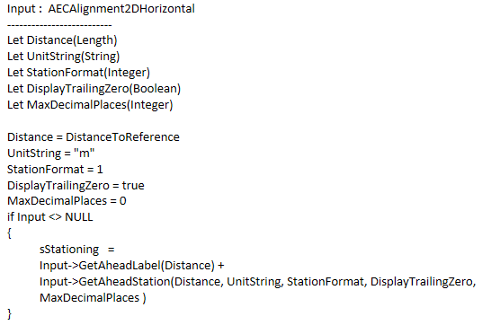

输入Input : AECAlignment2DHorizontal为平曲线

新建规则，根据文本标注的框架定义直线的位置：

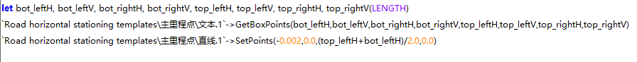

Point1_H（长度）：第一个点的水平坐标

Point1_V（长度）：第一个点的垂直坐标

Point2_H（长度）：第二个点的水平坐标

Point2_V（长度）：第二个点的垂直坐标

Point3_H（长度）：第三个点的水平坐标

Point3_V（长度）：第三个点的垂直坐标

Point4_H（长度）：第四个点的水平坐标

Point4_V（长度）：第四个点的垂直坐标

新建注释模板为主里程点，建立子注释模板，添加参数Major
Interval=200m，Minor
Interval=100m，并选择刚才建立的注释模板为子模板，以此主里程点为特征加入到目录并保存。

### 次里程点标注

新建详图，建立注释模板，添加字符串参数DistanceToReference、sStationing，绘制直线并添加文本注释如下：

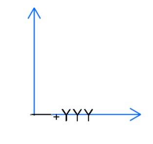

文本注释添加参数链接，添加方式同标题栏，添加actions并编辑脚本

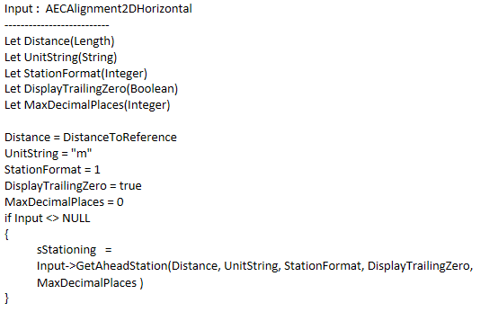

输入Input : AECAlignment2DHorizontal为平曲线

新建规则，根据文本标注的框架定义直线的位置：


新建注释模板为主里程点，建立子注释模板，并选择刚才建立的注释模板为子模板，以此主里程点为特征加入到目录并保存。

### 水平曲线规则集

新建规则集模板，并修改名称为道路水平规则集，右键规则集选择对象添加注释规则模板，定义名称Tangent

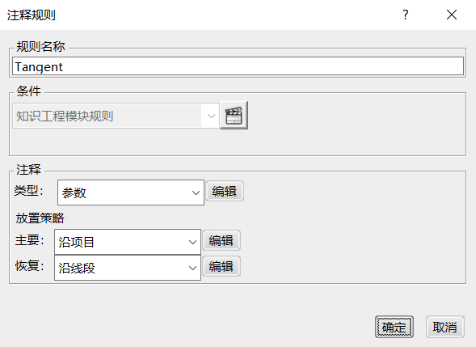

在条件栏添加脚本

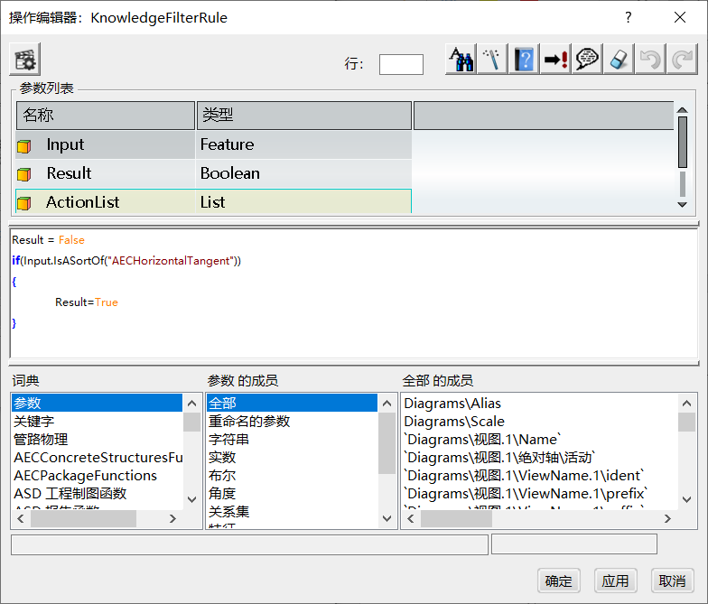

Input.IsASortOf("AECHorizontalTangent")选择输入为直线时，注释为真；

选择注释类型为参数，编辑参数注释，选择模板为保存的直线段注释模板

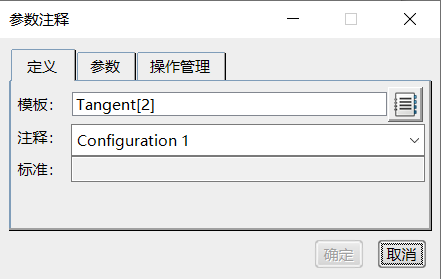

定义放置策略为沿项目

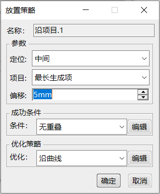

同样的方式，定义规则集内的圆弧段标注、缓和曲线拐点标注、圆弧中点标注、主里程点标注、次里程点标注等。

### 指北针

进入工程制图模板设计模块，打开Alignment view drawing
templates图纸文件，新建详图，新建2D部件，在此2D部件上画出所需要的指北针样式，如下图


新建标签模板，把此2D部件转换为标签模板，在智能模板注释工具条下，新建注释模板，定义模板名称，在注释工具条下选择初始化标签


，把标签模板实例化到注释模板内，并定义角度参数Angle_N

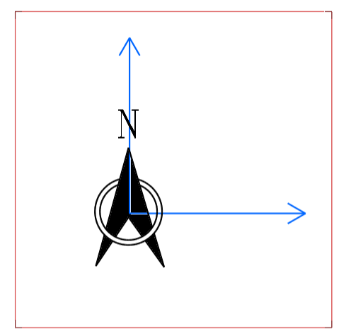

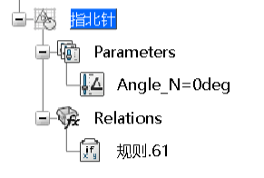

在关系集下添加规则，定义规则内容，使2D部件角度和Angle_N关联起来

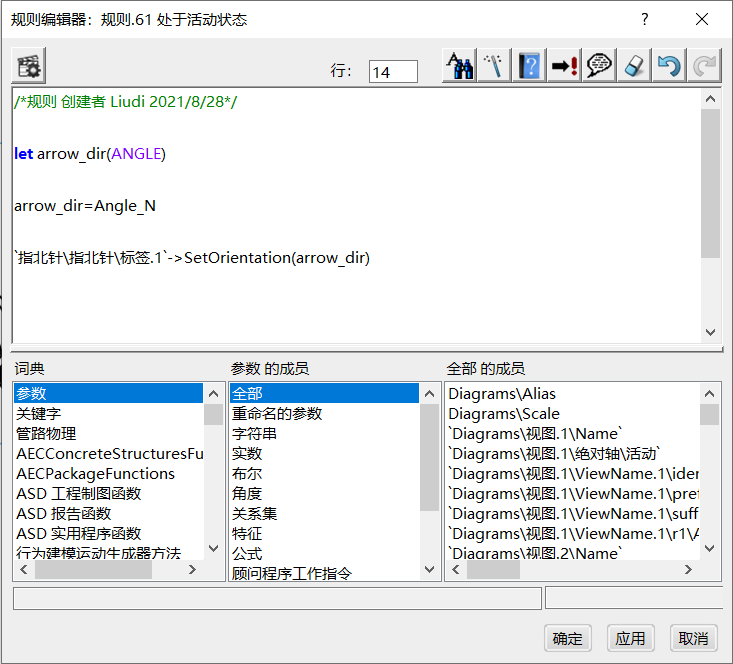

保存，把模板添加到Alignment drawing templates目录。

### 修改交点表表头

打开文件win_b64\resources\Civil\Alignment\PITableFormat.xsl，修改表头

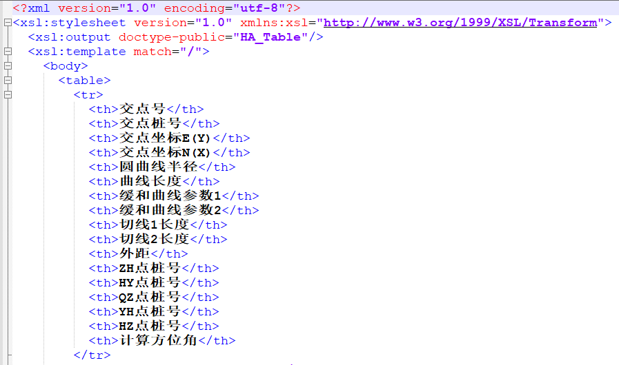

### 水平视图

新建视图模板，根据需求定义缩放比例为1：1000、1：200等；


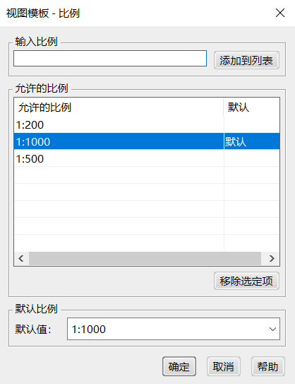

定义视图更新规则，添加规则集内的直线、圆弧等规则集

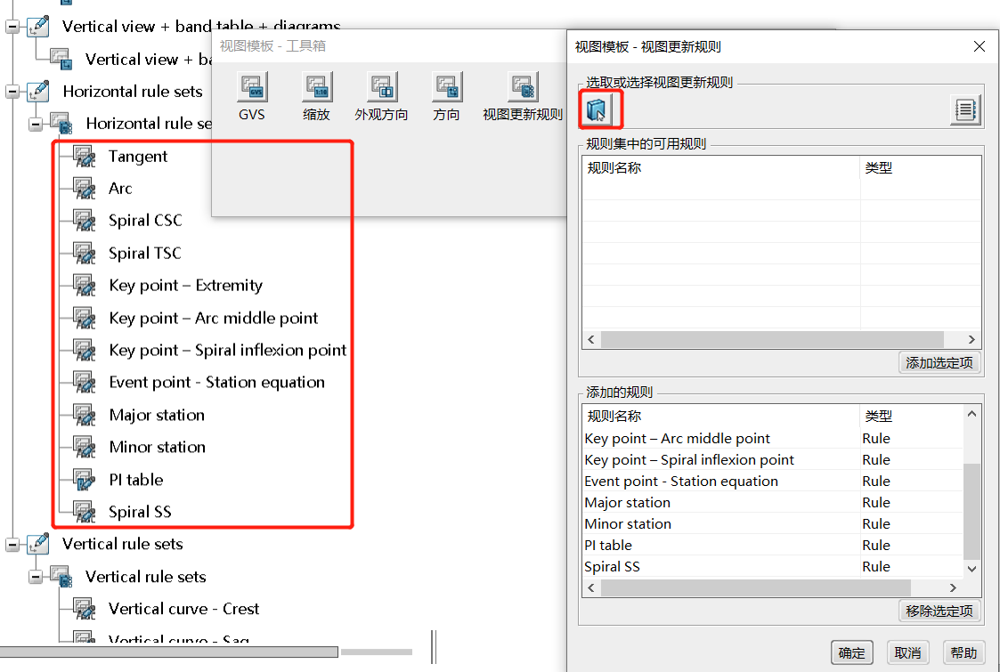

定义指南针

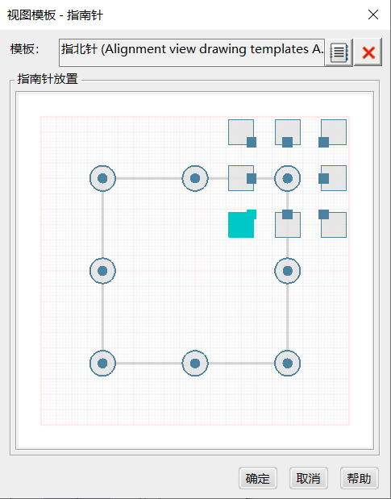

保存视图模板并加入到目录。

## 线路纵曲线

### 直线段标注

新建详图，建立注释模板，在注释栏下创建文本，文本内容String

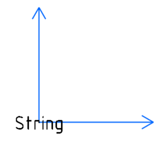

新建actions并编辑脚本

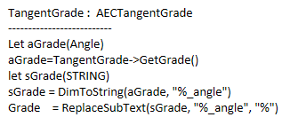

输入TangentGrade :
AECTangentGrade为纵曲线直线段，TangentGrade->GetGrade()为坡度，以下内容是把"%_angle"换成"%"。

保存并加入到目录。

### 圆弧段标注

新建详图，建立注释模板，在注释栏下创建文本，文本内容为纵曲线圆弧段的关键参数R、T、E，用草绘功能按照国内标注样式画出下图所示线段；新建参数R、T、E，并链接到文本标注；并把圆弧端点2D模板实例化到注释模板

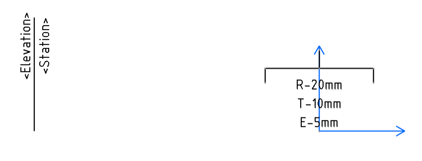

添加并编辑actions；

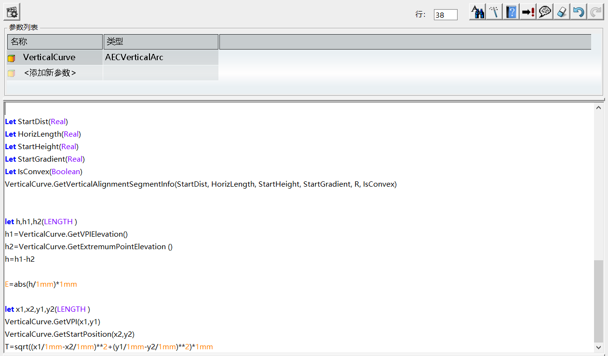

输入VerticalCurve: AECVerticalCurve为纵曲线圆弧段；

VertCurve.GetVerticalAlignmentSegmentInfo-------------------//检索有关垂直对齐线段的相关信息，输出半径R；

VertCurve.GetVPIElevation()----------------//获取交点标高

VertCurve.GetExtremumPointElevation
()----------------//获取曲线极值点标高

判断曲线弧度，上弧隐藏下半部分线段，反之隐藏上半部分曲线；

VertCurve.GetVPI(x1,y1) ----------------//交点坐标

VertCurve.GetStartPosition(x2,y2)
----------------//起点坐标

T=sqrt((x1/1mm-x2/1mm)**2+(y1/1mm-y2/1mm)**2)*1mm----------------//获取切线长。

保存并加入到目录。

### 汉化竖曲线表表头

打开win_b64\resources\Civil\Alignment下***
Format.xsl文件，修改文件title text

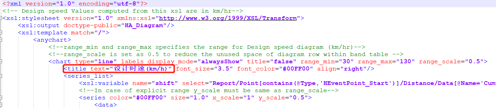

### 竖直曲线规则集

新建规则集模板，并修改名称为道路竖直规则集，右键规则集选择对象添加注释规则模板，定义名称Tangent

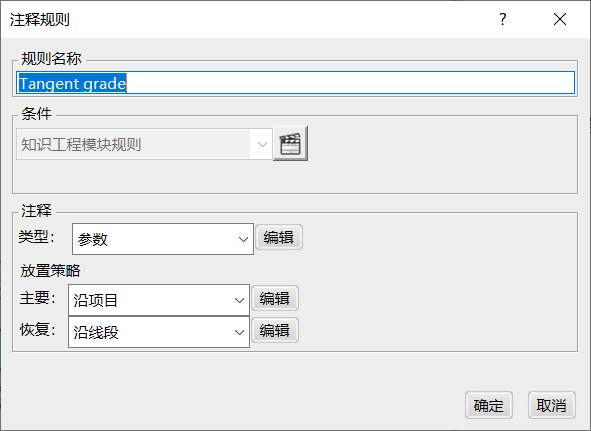

在条件栏添加脚本

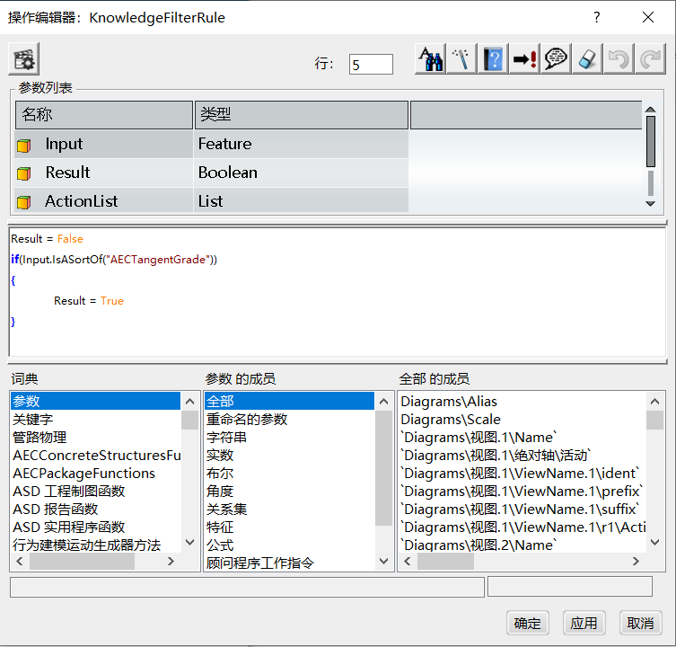

Input.IsASortOf("AECTangentGrade")输入为竖曲线直线段时，标注为真；

选择注释类型为参数，编辑参数注释，选择模板为保存的直线段注释模板

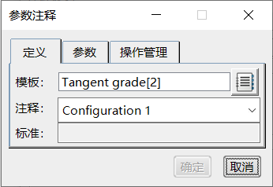

定义放置策略为沿项目

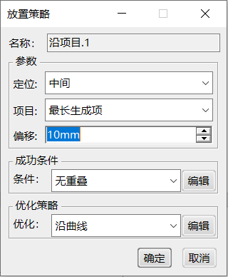

同样的方式，定义规则集内的圆弧段标注。

### 垂直试图

新建视图模板，根据需求定义缩放比例为1：1000、1：200等；

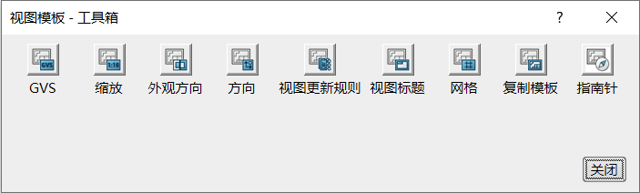


定义视图更新规则，添加规则集内的直线、圆弧规则集

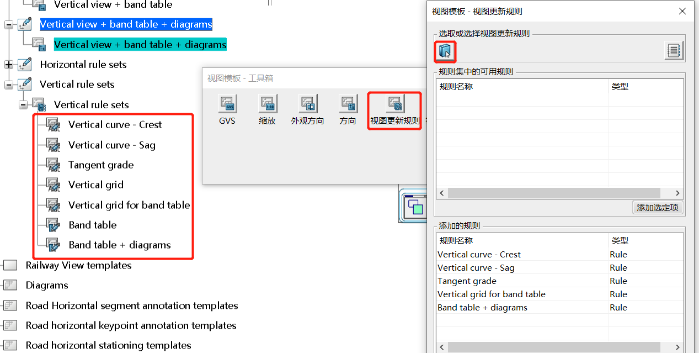

保存视图模板并加入到目录。

# 线路出图

## 添加环境变量

找到文件B423\CATEnv\
Env.txt并打开，添加以下环境变量，保存文件重启客户端。

```xml
CEG_SUBGRADE=1
CEG_DRAINAGE=1
SDW_ALIGNMENT_VIEW_LA=1
DRW_ALLOW_AITACMODELER=1
SDW_VA_ANNOTATIONS_LA=1
SDW_STATIONING_GRID_LA=1
SDW_TRANSCRV_KEYPOINT_ANNOTATION_LA=1
ASD_VERTICAL_ALIGNMENT_VIEW_LA=1
CEG_HorizontalViewMargin=1
SDW_VA_GRID_LA=1
SDW_BRIDGE_GRID_LA=1
SDW_SECTIONING_LA=1
SDW_AUTOMATION_ALIGNMENT_LA=1
set SDW_BATCH_LA=1
CATDX_IFC_Alignment=1
CEG_CAA_Alignments=1
CEG_REBAR_DRAWING=1
SddSteelConnection=1

```

## 线路出图

新建ASD工程图，点击创建对齐视图

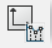

，

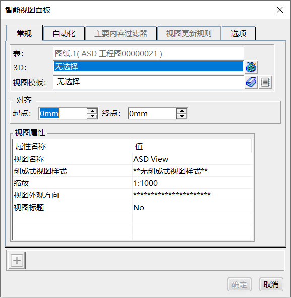

到模型窗口选择水平对齐

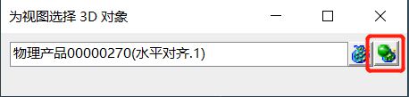

点击目录，选择视图模板

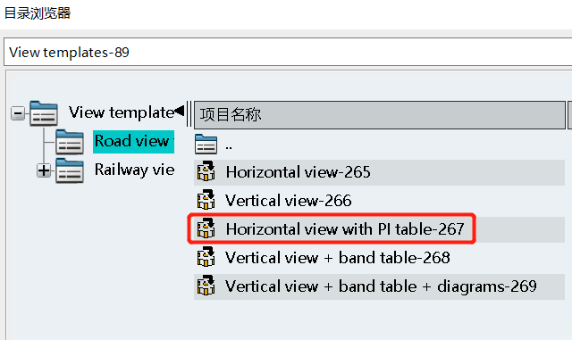

确定，创建平曲线图纸

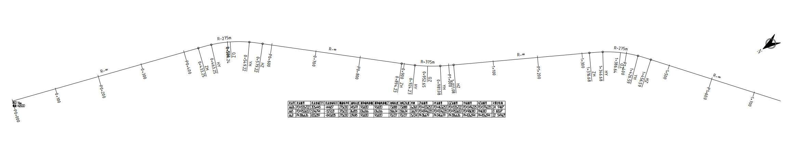

再次创建对齐视图，选择垂直对齐

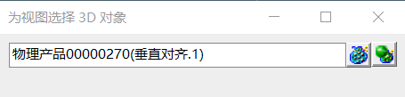

点击目录，选择视图模板

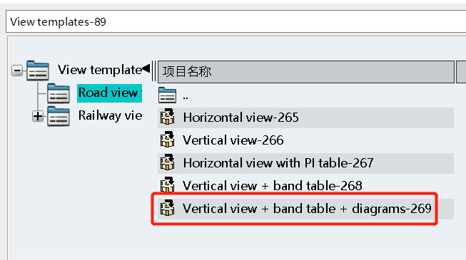

确定，创建竖曲线图纸

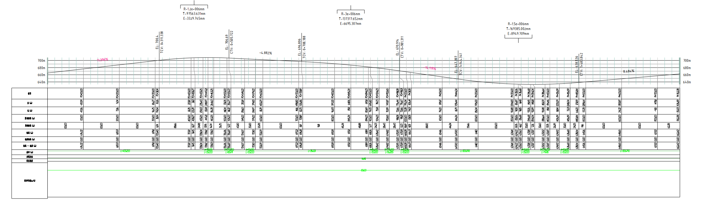

