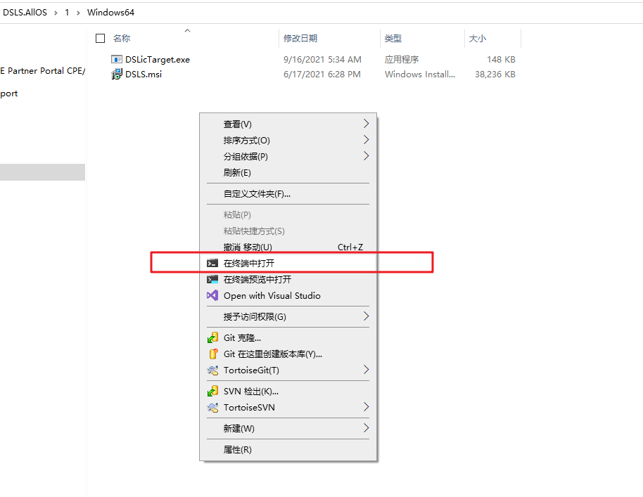

# 获得ID

下载 7z 文件，解压出来。

[DSLicTarget文件](./DSLicTarget.7z)

## 获得当前网卡ID

    .\DSLicTarget.exe -t

可以获得当前默认的网卡ID

__把以上信息截图或者复制出来发送给我__

##   获得所有

使用cmd  进入软件所在的目录，输入 

    .\DSLicTarget.exe -l

可以查看所有支持的网卡ID

## 获得帮助

	.\DSLicTarget.exe -h

可以获得帮助，比如如何切换网卡等等，

	PS C:\Users\user\Downloads\DSLS.AllOS\1\Windows64> .\DSLicTarget.exe -h
	DSLicTarget (version 1.21)
	C:\Users\user\Downloads\DSLS.AllOS\1\Windows64\DSLicTarget.exe:
	-t       : Display the computer id
	-l       : List available network adapters
	-c       : Clear Windows registry key
	-s {...} : Use a specfic device identifier to generate the computer id. Ex: DSLicTarget -s {558CBA02-9E12-33F7-49A9-1154BED416A6}

## 切换网卡

    .\DSLicTarget.exe -s {906002D7-0C58-47CD-91C9-F68A64EF5DCB}

这个就是之前命令打印出来的.
    Identifier : {906002D7-0C58-47CD-91C9-F68A64EF5DCB}

