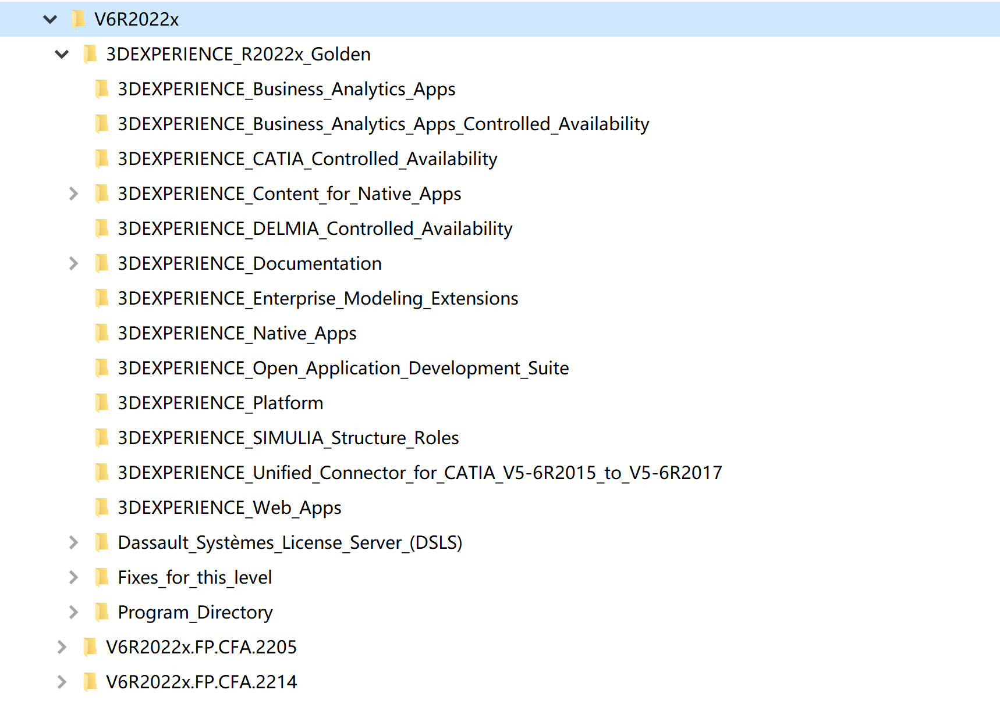

# 管理达索的软件

软件安装包分文件夹放置在不同的位置，方便以后安装

## 普通用户

对于一般用户，只需要以下的软件即可，文件夹也按照如下管理。__存储路径不要有中文__

    1. 3DEXPERIENCE_R2022x_Golden\3DEXPERIENCE_Native_Apps
    2. V6R2022x.FP.CFA.xxxx


## 高级用户

=== "__3DEXPERIENCE_R2022x_Golden__"

    ```xml
        3DEXPERIENCE_Business_Analytics_Apps
        3DEXPERIENCE_CATIA_Controlled_Availability
        3DEXPERIENCE_Content_for_Native_Apps
        3DEXPERIENCE_Unified_Connector_for_CATIA_V5-6R2015_to_V5-6R2017
        3DEXPERIENCE_Business_Analytics_Apps_Controlled_Availability
        3DEXPERIENCE_DELMIA_Controlled_Availability
        3DEXPERIENCE_Documentation
        3DEXPERIENCE_Enterprise_Modeling_Extensions
        3DEXPERIENCE_Native_Apps
        3DEXPERIENCE_Open_Application_Development_Suite
        3DEXPERIENCE_Platform
        3DEXPERIENCE_SIMULIA_Structure_Roles
        3DEXPERIENCE_Web_Apps
        Dassault_Systèmes_License_Server_(DSLS)
        Fixes_for_this_level
        Program_Directory
    ```

=== "__补丁__"

    补丁只需要一个总体文件夹即可，所有不同组件都放在一个文件夹中
    
    ```xml
        V6R2022x.FP.CFA.2205
        V6R2022x.FP.CFA.2214
    ```

