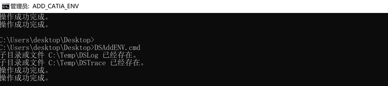
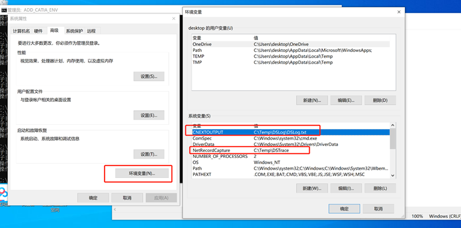
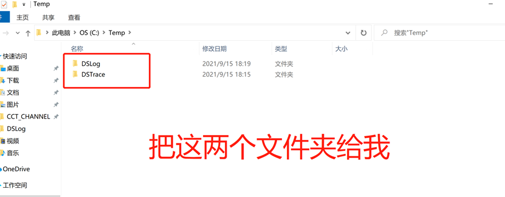

# 获得CATIA日志

#### 方式一

管理员运行CMD,输入以下命令，也可以手动打开文本编辑器

```batch

echo  CNEXTOUTPUT=C:\Temp\DSLog\DSLog.txt >> "C:\Program Files\Dassault Systemes\B423\CATEnv\Env.txt"
echo  NetRecordCapture=C:\Temp\DSTrace >> "C:\Program Files\Dassault Systemes\B423\CATEnv\Env.txt"

```
#### 方式二
把环境变量加到系统中，与上面的二选一即可
```batch

@echo off 
title ADD_CATIA_ENV
md C:\Temp\DSLog
md C:\Temp\DSTrace
echo  log start>C:\Temp\DSLog\DSLog.txt
set regpath=HKEY_LOCAL_MACHINE\SYSTEM\CurrentControlSet\Control\Session Manager\Environment
set catlog=CNEXTOUTPUT
set nrclog=NetRecordCapture
set catpath=C:\Temp\DSLog\DSLog.txt
set nrcpath=C:\Temp\DSTrace
reg add "%regpath%" /v %catlog% /d %catpath% /f
reg add "%regpath%" /v %nrclog% /d %nrcpath% /f
pause>nul


```





#### 日志打包

把下面的文件夹发送给我



