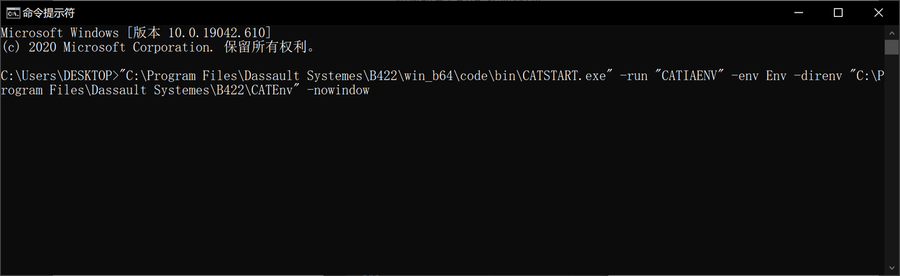
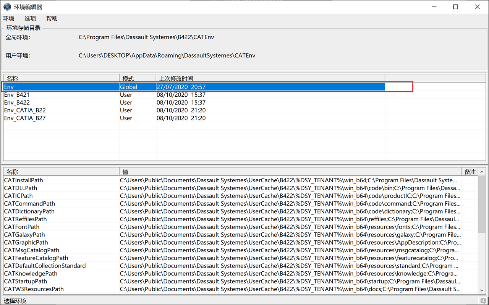
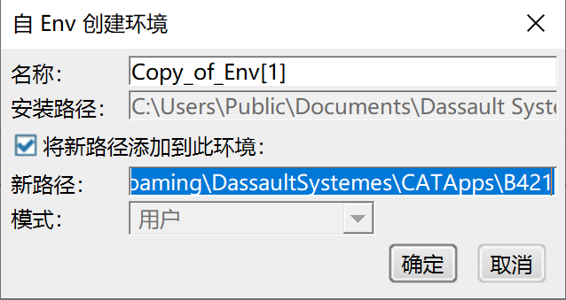
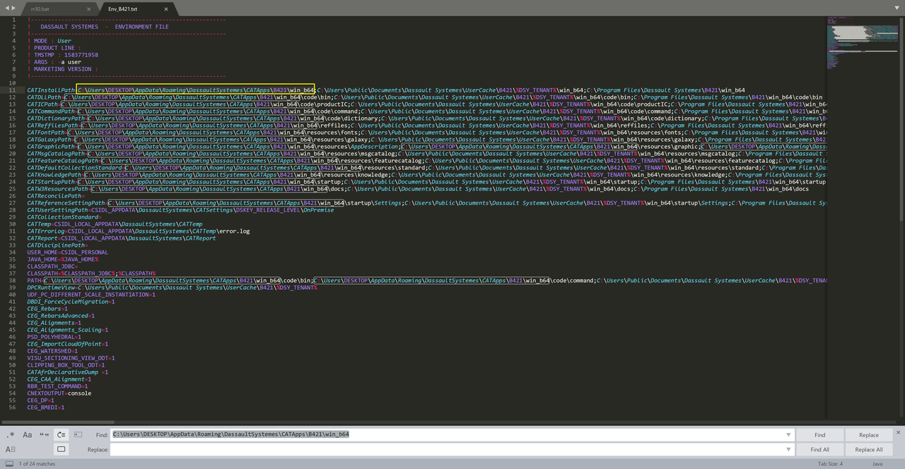

# 如何部署APP

1. 打开一下文件路径。

或者在命令行输入以下文字，路径根据自己的CATIA 安装位置修改。

"C:\Program Files\Dassault Systemes\B422\win_b64\code\bin\CATSTART.exe" -run "CATIAENV" -env Env -direnv "C:\Program Files\Dassault Systemes\B422\CATEnv" -nowindow

2. 选择如下行

指定一个名称和扩展程序包的路径，不必包含win_64.

打开环境变量地址：
C:\Users\%username%\AppData\Roaming\DassaultSystemes\CATEnv
检查之前自动新建的环境变量txt文件，检查路径正确，确保没有错误。

3. 创建快捷方式

桌面新建.cmd文件，路径如下格式

"C:\Program Files\Dassault Systemes\B421\win_b64\code\bin\CATSTART.exe" -run "3DEXPERIENCE" -env Env_B421 -direnv "C:\Users\DESKTOP\AppData\Roaming\DassaultSystemes\CATEnv" -nowindow

1. 红色为CATIA 安装目录
2. 蓝色为你的环境变量名称
3. 紫色为环境变量目录
   双击运行
