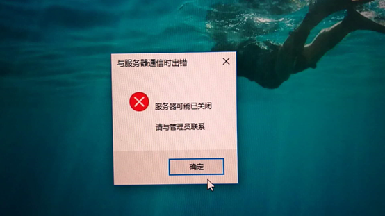
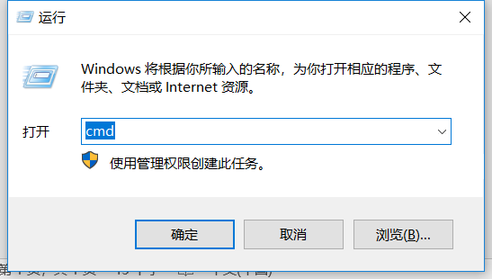
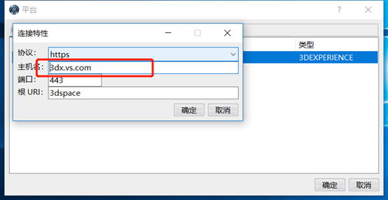
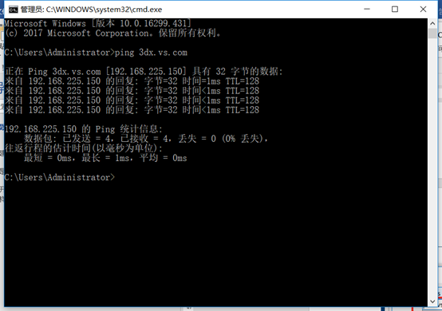
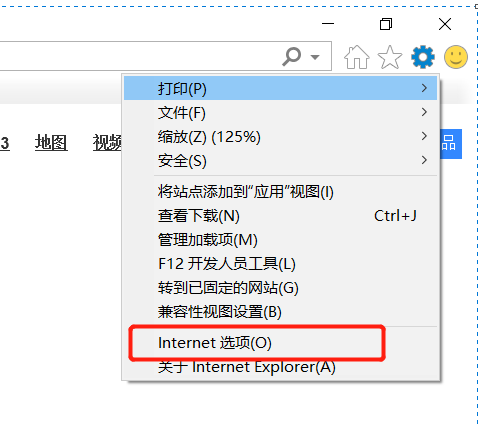
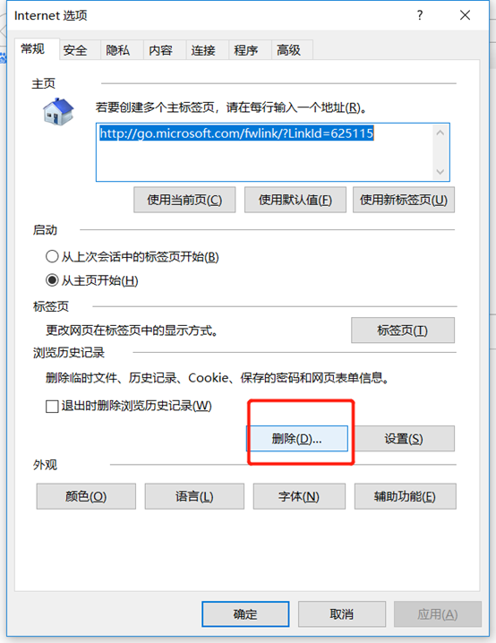
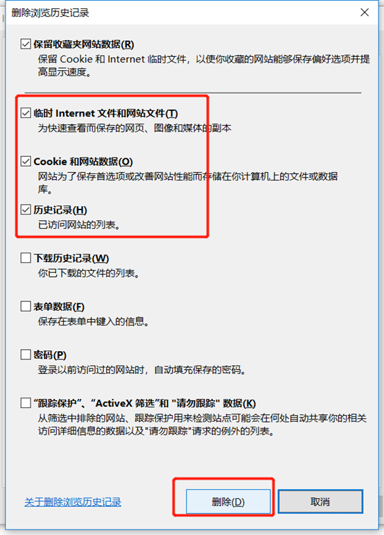
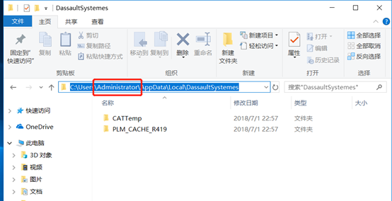

# 平台出现客户端无法连接

如果3de平台出现客户端无法连接时，并报以下错误：

解决方法 ：

首先检查客户端电脑网络是否联通 ：

在dos窗口用ping 命令检查是否可以联通到服务器 

Ping地址为客户端连接的服务器地址 ：

出现以下字样 ，说明网络可以连接到服务器

如果网络没问题 ，清理ie缓存 

清理客户端缓存：

红框内为当前电脑登录用户，清理该文件夹下内容。

然后重启电脑 
