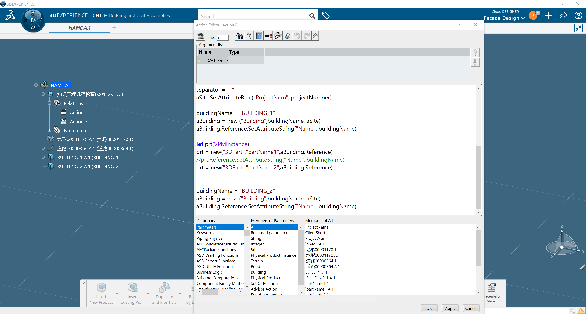

# 创建结构树



```java

/* 工作指令 创建者 user 2023/10/26 */

let separator,cellStr,siteName, buildingName(String)
let projectNumber(Integer)
projectNumber=111
let aSite(AecSite)
let aBuilding(VPMInstance)
let lastStorey(VPMInstance)
let elemAssembly(VPMInstance)
aSite = GetEditorRoots("AecSite").GetItem(1) 

aSite.SetAttributeString("Name", "NAME")
aSite.SetAttributeString("ProjectName", "NAME")
aSite.SetAttributeString("ClientShort", "NAME" )
aSite.SetAttributeReal("ProjectNum", projectNumber)
separator = "-"
aSite.SetAttributeReal("ProjectNum", projectNumber)

buildingName = "BUILDING_1"
aBuilding = new ("Building",buildingName, aSite)
aBuilding.Reference.SetAttributeString("Name", buildingName)

let prt(VPMInstance)
prt = new("3DPart","partName1",aBuilding.Reference)
//prt.Reference.SetAttributeString("Name", buildingName)
prt = new("3DPart","partName2",aBuilding.Reference)


buildingName = "BUILDING_2"
aBuilding = new ("Building",buildingName, aSite)
aBuilding.Reference.SetAttributeString("Name", buildingName)

```