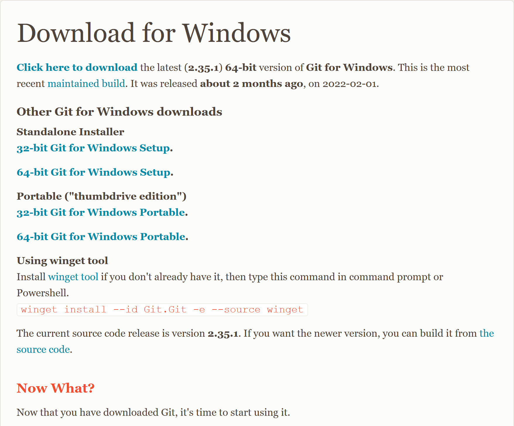
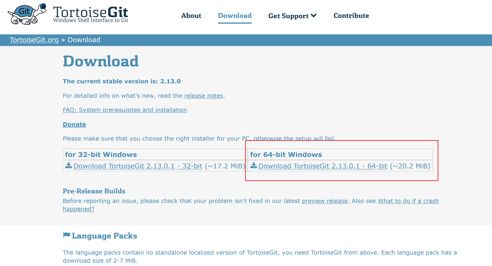
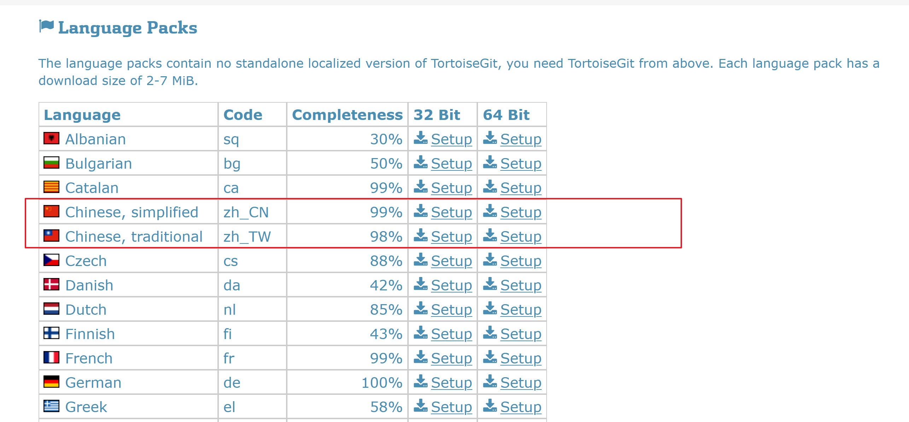

# Git 使用帮助

## 创建本地SSH证书
windows 进入进入powershell命令行，输入以下两个命令获得证书

### 生成公钥
    ssh-keygen -t rsa
直接按{ENTER},生成密钥

### 查看公钥
    cat ~/.ssh/id_rsa.pub

## 下载 Git

https://git-scm.com/download/win

可以下载免安装版本 64-bit Git for Windows Portable.

之后可以通过命令行使用Git 

## Git 常用客户端一
如果不愿意使用命令行，推荐使用下面的工具。

https://tortoisegit.org/

以后就可以通过右键菜单去添加Git 了

## Git 常用客户端二
如果不愿意使用上面的工具，Visual Studio 都自带了管理工具，也可以使用。只要克隆下来代码仓库即可使用

## Git 仓库
为了保证大家可以协同开发，我们需要建立一个公共仓库去互相访问
常用的仓库有
* https://github.com/
* https://gitee.com/
* https://e.coding.net/signin
* https://gitea.com/
* https://gitlab.com/

等或者自建企业内部仓库。这里我们推荐使用
* https://gitee.com/ 

可以绑定自己的微信，随时查看别人更新的代码

## 本地电脑 SSH 设置
将之前获得的密钥填写进自己的账号内

这样以后更新自己的代码就无需每次输入密码和账号了

## 克隆别人的代码
进入一个自己项目的文件夹，右键菜单克隆仓库，克隆的时候选择  SSH 

