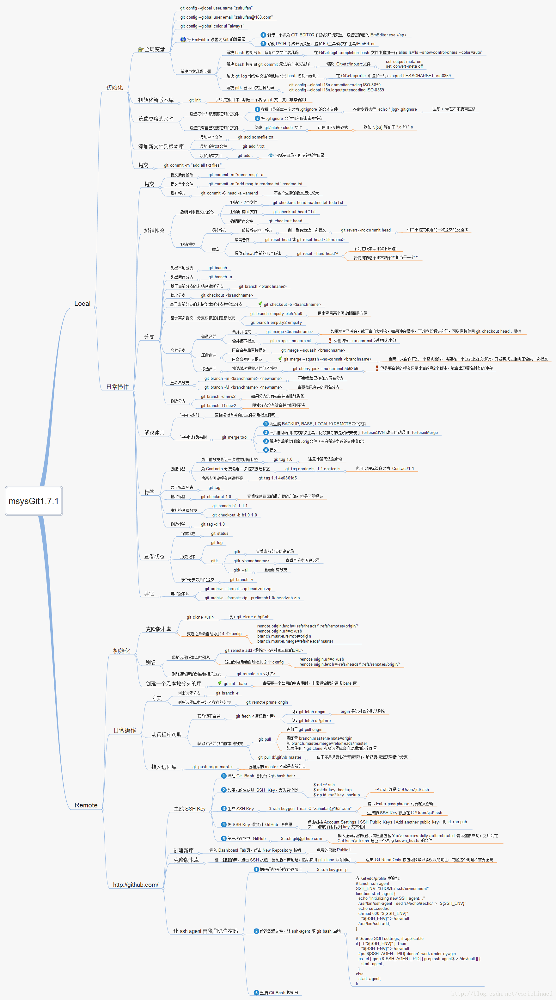

# git 教程

## Git 全局设置:

```bash
git config --global user.name "xuscode"
git config --global user.email "song_hsu@126.com"
```

## 创建 git 仓库:

```bash
mkdir my-note
cd my-note
git init
touch README.md
git add README.md
git commit -m "first commit"
git remote add origin git@gitee.com:xuscode/my-note.git
git push -u origin "master"
```

## 已有仓库?

```bash
cd existing_git_repo
git remote add origin git@gitee.com:xuscode/my-note.git
git push -u origin "master"
```


## 教程

